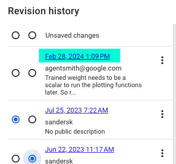
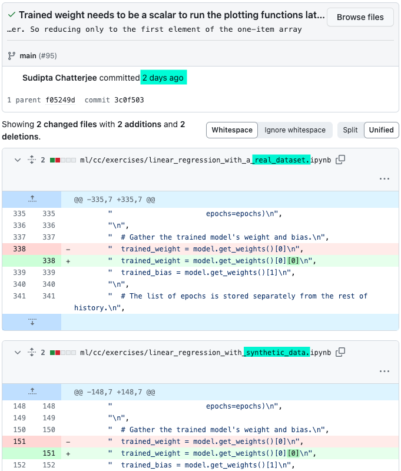

          <h2>Machine Learning Crash Course, Let's Play</h2>
          
I've been working through the <a href="https://developers.google.com/machine-learning/crash-course">Machine Learning Crash Course</a> from Google. I'm really happy with it, despite not generally trusting Google or its products. In fact, there are several resources in this ML section of their Developer's website that look really interesting to go through. Some more general guidance pieces, and some shorter, more <a href="https://developers.google.com/machine-learning/advanced-courses">hands-on courses</a> that dive deeper into specific algorithms. Anyway, I thought I'd write a bit about my experience with it here.

          
For those that haven't looked at the course yet, it's supposed to take about 15 hours, and features short lecture videos from ML developers at Google. Each video has a written, article-like page that covers the content in the video. I think they scripted the videos based of the content on the written pages because the content is generally exactly the same. The best part of all, though, are the hands-on programming exercises!

          
The hands-on programming exercises occur on  platform in pre-written notebooks. The notebooks so far provide some setup and explanation, explaining any concepts or code that are being set up, and have ended with exercises, referred to as "tasks."

          
On one of the <a href="https://developers.google.com/machine-learning/crash-course/first-steps-with-tensorflow/programming-exercises">first exercises pages</a>, I ran into a bug in the . I spent some time looking at the error and troubleshooting and eventually fixed it.

          
Interesting to note that two separate generative models did not offer the correct solution to the error. I attempted with both free ChatGPT as well as Google's built-in generative  about the error.

          
I went back to basic programming debugging to resolve the error - simply printing out the variables it was complaining about to gain insight into why the different functionality was complaining about the data's formats.

          
Ultimately, it turned out to be an issue with the format of the model <a href="https://keras.io/api/layers/base_layer/#get_weights-method">weights</a> produced after <a href="https://www.tensorflow.org/api_docs/python/tf/keras/Model#fit">fitting</a> the model. Looking closer at the different variables and comparing them to the error, this weights variable stuck out like a sore thumb. The weights ended up taking the form of a Python list inside of a list. This is because the <a href="https://keras.io/api/layers/base_layer/#get_weights-method">model.get_weights()</a> method returns the weights for every layer inside the model. In other words, a list containing a list of weights for each layer of the model is returned.

          
<em>As a quick reminder, arrays in Python are called "lists."</em>

          
The relatively simple fix was to update the variable to be initialized to the inner list (the weights of the specific layer), as opposed to the "parent" list (that contains lists of weights for all layers). Now our variable contains a single list, instead of a list inside of a list. Simple:

          <pre><code>
# Before:
original_list = [[99]]
my_list = original_list

print(my_list) # Prints [[99]]

# After:
original_list = [[99]]
my_list = original_list<strong>[0]</strong>

print(my_list) # Prints [99]
          </code></pre>

          
What is so funny to me is that immediately after I ran into this. This was updated and fixed in the original notebook:

          

          
Here's <a href="https://github.com/google/eng-edu/commit/3c0f5037331cbc937a5edda7efeb0b63d7f80695">the link</a> to the GitHub commit associated with this change:

          

          
I found this validating that I had discovered the correct fix to this issue, but also a little unnerving. Does Google really have such good monitoring and capability to execute that almost immediately after this error fired they were able to allocate a resource to address it? O_o Unlikely, but would be such a strange coincidence on the timing otherwise...

          
Anyway, I figure I'll post  of my Colab notebook from when I went through this exercise. This is pretty early on in the course so nothing too exciting here.

          
Thanks for reading!

          
<em>Andrew Antles</em>
