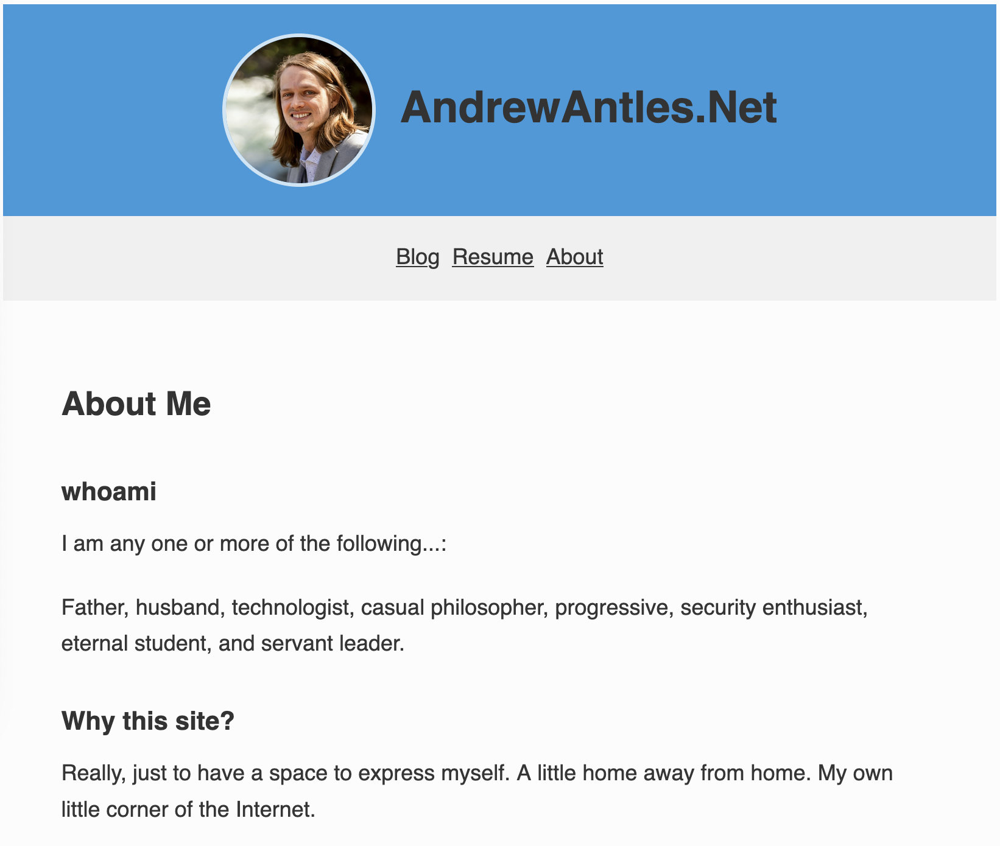

# Project Mission - north star
Challenge and deepen my security engineering skills by deploying and running the technical components of a cyber security program on my personal network. 

# Documentation
## Tools and Implemenation Support
- https://learn.cisecurity.org/Essential-Cyber-Hygiene-v8.1

# Narative

## Opening
Hello, and welcome back. Another week, another... something. Let's talk about how things went and how they are going. This post will start out as a bit of a journal entry. If you're just interested in the technical details, jump ahead to the [Blog Visual Updates](#blog-visual-updates) section.

I subscribed to Claude Pro this week. I'm really excited about it. I've got Claude Code running both locally and "on the Web."

I opened up several Claude Code windows and got to work, only to quickly realize, I had uninstalled XCode from my Macbook at some point, and didn't have `git` available to start branching and landing changing. I'm not going to do this if I can't stay organized. (Why did I spend an entire week identifying a framework and program structure to follow?) I've witnessed too many "programs" that feel like "shoot from the hip" judgement calls, and there's just no structure there. Too easy to introduce bias. Too easy for opinions and ideas to change from week to week. Too easy to overlook simple fundamentals. Difficult to document policies and retain "sources of truth" for future reference regarding decisions and agreements. But, I digress. 

So, I quickly got derailed and had to spend part of an hour troubleshooting an App Store install error. This hurt, because I was already off to a late start due to some troubleing news that affected my family and that I felt compelled to attend to. (It was the right call.) But, at this point, I have `git` installed, an SSH key with passcode, and can start pushing commits. Let's get to it!

## Blog Visual Updates
My blog was in somewhat sad shape, so I spun up a Claude Code window to analyze it for problems, and I seeded it with a few of the obvious issues I was seeing. Overall I made some changes that I feel a lot more confident and proud about, including the following:
- Updated fonts throughout
- Resized and optimized the header
- Resolved issues with how the social icons were displaying
- Added the 2025 version of my resume
- Updated the About Me page language
- Added copyright footer with social links on all pages

Here are a couple of screenshots showing the before and after. Much improved and much fresher feel if you ask me. Feel free to navigate around and check it out for yourself! [AndrewAntles.Net](https://andrewantles.net)

### Before

### After

## Other Progress
I felt it was important to refresh my blog this week, since it is the front door to this security program content that I'm putting together. That's not to say that I didn't make progress on the overall program. I made several kind of baby steps towards the overall goal, but first:

### Revelation (of the week?)
I had a bit of a revelation following an on-site training at my current employer by Anthropic: *A majority of work will be flowing through agents.* It sounds like this is already happening at Anthropic - the trainer described walking through the office and seeing multiple Claude Code windows open on every workstation. And, with the beta release of Claude Cowork last week, enabling lower-barrier Claude Code-like workflows on documents, browsers, and more, I have the strong feeling that, I should get used to interacting with my technical environments via LLM tools, basically now. 

I don't ever want to forget my roots and fundamentals. I believe these are going to be even more important as we work through scores of agents, not less. We'll need to be able to jump in and play clean-up crew, much like a Staff or Principal Engineer called in to debug and resolve thorny, ambiguous problems.

In other words, our skills have to get even sharper. It's not that work will be replaced. It's actually even bigger stakes, operating at even higher levels.

The best engineers will be those that are:
- most comfortable interacting with their technical environments via agentic tooling,
- able to hold many different workstreams in their head, 
- able to stay extremely organized to reduce the cost of context switching, and
- able to dig in and resolve thorny, ambiguous problems quickly and completely. 

Part of this conclusion came to me just today as I worked on:

#### Blog CSS Styling
Claude was moving quick and asking to make changes I didn't fully understand. If my architecture gets away from me, I could really land in trouble and make my life a lot more difficult down the road having to untangle something that me and my agents agree is spaghetti code in a domain I don't spend as much time in.

I compensated by this with prompting along the lines of "slow down and describe you recommended approach to the problem, along with any alternatives you think are worth considering. For each change I need to understand what is changing, how that element works, why it needs to change, and what the expected output is." 

After writing that the second time, I quickly dumped it into my `CLAUDE.md` file. It really helped keep things clear and prevented sweeping architecture changes.

### Local Agent Sandbox
If you're running a local agent on your trusted, daily driver, sooner or later you're going to run into trouble. Either that, or you'll have to slow yourself way down to selectively approve prompts so your daily driver doesn't get wrecked.

Quick plug for the [Lethal Trifecta](https://simonwillison.net/2025/Jun/16/the-lethal-trifecta/) by Simon Willison. I feel like this is basically industry-standard knowledge at this point, and is a great, simplified way to enumerating agent risk.

In the Trifecta, our host machine is our "private data," and until we can effectively cut off one of the legs of the Lethal Trifecta, we're at risk of our agents being turned against us. 

To that end, Simon also recently linked to [this very informative post](https://www.luiscardoso.dev/blog/sandboxes-for-ai) by Luis Cardoso breaking down sandbox fundamentals and exactly what certain isolation paradigms do, don't do, and the performance and maintenance trade offs of eacy. I highly recommend saving a local copy for future safe keeping. Of both of these blog posts actually. 

Then, while setting up Claude Code, I read into the Claude Code [.devcontainers setup guide](https://code.claude.com/docs/en/devcontainer). Having read the article by Luis Cardosa, I was surprised to see the lack of mention of seccomp profiles, and the focus on network-only sandbox controls. Which, I suppose just makes me really thankful to have discovered Cardosa's article, because I was thinking of sandboxing primarily as a network layer control, as opposed to thinking about how the OS kernel is shared or accessed - something he calls out directly in his post! 

So, more digging and understanding to do here to develop a robust agent sandbox solution, but sort of "ripped the bandaid off," and found some really good sources that we should be able to make something really comprehensive out of. 

### Personal Security Program
Last, but not least! 

One of the easiest to leverage, and most time saving features of Claude Pro is the [Research feature](https://claude.com/blog/research). I included this Center for Internet Security (CIS) [Cyber Hygiene guide](https://learn.cisecurity.org/Establishing-Essential-Cyber-Hygiene) since it contains tool recommendations, along with a prompt asking it to prioritize Docker workloads, and tools that I can collaborate with LLM agents on (i.e. with API and CLI tools or MCP support). 

Come to think of it, it doesn't seem like very many of the open source security tools support MCP at this point - maybe a good place to make some contributions 🤔 hmm... Note to self.

Additionally, I gave it a description of my devices, a rough layout of my network, and told it to tell me how much I can run on a Raspberry PI 4, as well as when I need to upgrade my "security node" to handle bigger workloads as my program matures. It came back with a promising plan, and I look forward to implementing some of the elements for it.

### Fun Tidbits
Other interesting things I spent time thinking about and learning about this week were AI data centers and Google's TPU chips. I also spent some time watching Andrej Karpathy's [Youtube lecture](https://www.youtube.com/watch?v=kCc8FmEb1nY&list=PLAqhIrjkxbuWI23v9cThsA9GvCAUhRvKZ&index=7) about how to build ChatGPT from first principles based on the famous and foundational [*Attention is All You Need*](https://arxiv.org/abs/1706.03762) paper. (Karpathy video link in full course playlist)

Until next time!

*Andrew Antles*